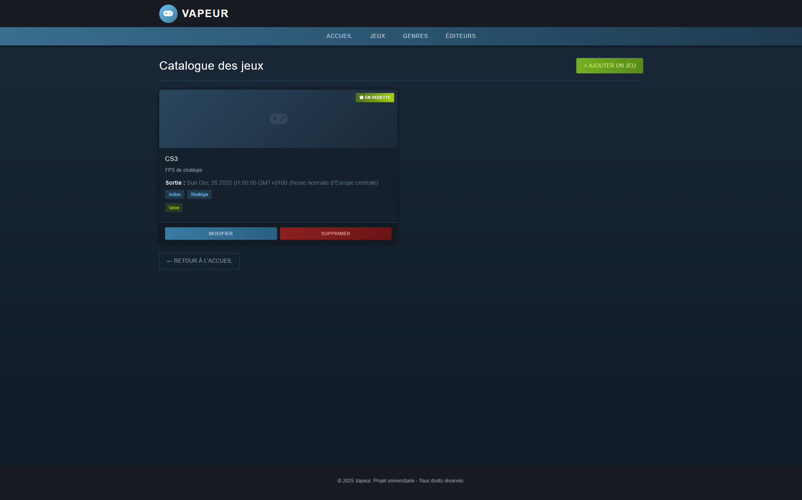
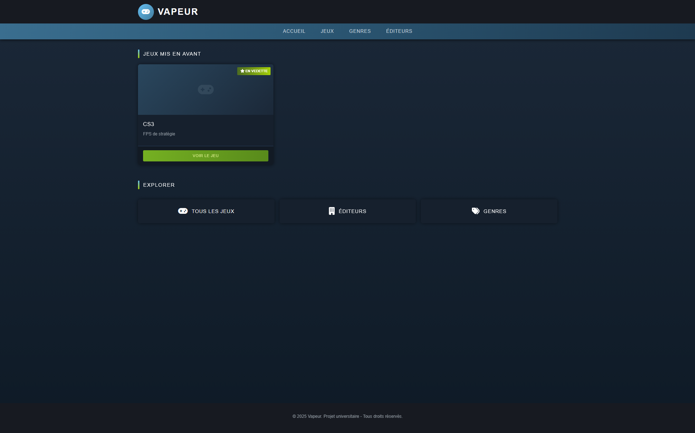

# Projet Vapeur - Application web  


### Instructions d'installation et de lancement
```bash
git clone <repo-url>      # Cloner le projet  
npm install               # Installer les paquets  
npx prisma generate       # Générer le client Prisma
npx prisma migrate dev    # Créer et appliquer les migrations    
npm run start             # Lancer le projet  
```

### Ou installer avec l'exécutable
```start.sh```

### Besoins pour lancer le projet
- Node.js
- NPM
- Prisma
- SQLite
- un fichier .env avec les variables d'environnement nécessaires

## Aperçu



# Credits Projet-Vapeur
[Clément BOUNAIX](https://github.com/loazur)  
[Lucas CONTRERAS-HODAPP](https://github.com/Por-Tra)   
[Nathanaël MORIT](https://github.com/Mortann)  
[Lucas CHAPON](https://github.com/LucasChap-git)
